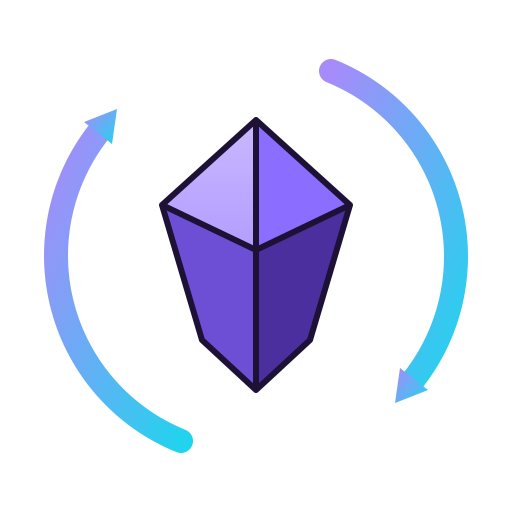
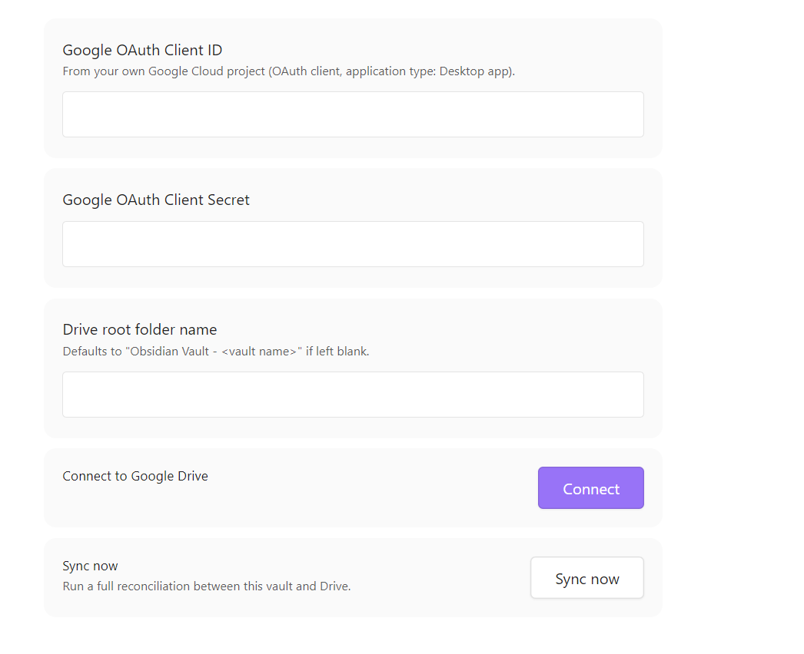
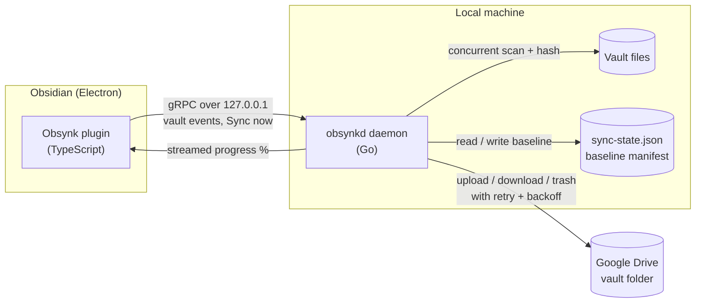

<div align="center">



# Obsynk

**Two-way sync between your Obsidian vault and Google Drive — powered by a local Go daemon.**

[](https://go.dev)
[](https://www.typescriptlang.org)
[](LICENSE)
[](#requirements)

</div>

---

## What is Obsynk?

Obsynk keeps an Obsidian vault in sync with a folder in your own Google Drive, in **both directions**. Your notes stay plain files on disk; Drive just holds a mirror of them.

The heavy lifting — walking the vault, hashing files, and transferring them — runs in a **Go daemon** that the plugin starts and stops alongside your Obsidian session. Go's concurrency is what makes scanning and uploading a few thousand notes fast: files are hashed by a bounded worker pool and transfers run concurrently with rate-limit-aware backoff, rather than one file at a time.

Everything is local and self-hosted: you supply your own Google OAuth credentials, and no data ever passes through a third-party server.

## Screenshots

> Settings tab — connection status, credentials, Drive folder link, and manual sync.



> Live progress during a full sync, with operation count and percentage.


## Features

- **Two-way sync** — changes flow local → Drive and Drive → local.
- **Concurrent Go engine** — worker-pool file hashing and parallel transfers, not a serial loop.
- **Three-way change detection** — a persisted baseline manifest distinguishes "changed locally" from "changed remotely" from "changed on both sides", so an unmodified file is never needlessly re-uploaded.
- **Last-write-wins conflict resolution** — when both sides changed, the newer modification time wins (see [Known limitations](#known-limitations)).
- **Automatic sync on vault changes** — create / modify / delete / rename events are debounced (~1.8s of quiet) and batched.
- **Cheap renames and moves** — a renamed note becomes a metadata-only Drive rename instead of a delete-and-reupload.
- **Manual "Sync now"** — command palette, ribbon icon, or the settings tab, with live progress and percentage.
- **Live status** — status bar shows idle / syncing `x/y (z%)` / error; the settings tab shows the connected account, last sync time, and a direct link to the Drive folder.
- **Persistent logs** — `obsynk.log` (plugin) and `obsynkd.log` (daemon) in the plugin folder, so failures are diagnosable after the fact without the dev console open.
- **Secrets stay local** — OAuth credentials and tokens are written to the vault's plugin folder with `0600` permissions and are never synced to Drive.
- **Multi-window safe** — opening the same vault twice reuses one daemon via a lockfile instead of spawning a second.

## Use cases

| Use case | How Obsynk helps |
|---|---|
| **Off-site backup of a vault** | Every note is mirrored into a Drive folder you own, updated as you write. |
| **Two-machine workflow** | Edit on a desktop, pick up on a laptop — both sync against the same Drive folder. See [the note on multi-machine setups](#multi-machine-setup). |
| **Access notes without Obsidian** | Notes land in Drive as ordinary `.md` files, readable from Drive's web UI or mobile app. |
| **Vendor-independent sync** | An alternative to Obsidian Sync that uses storage you already pay for and control. |
| **Recover a deleted note** | Deletions are moved to Drive's trash rather than hard-deleted, so there's a recovery window. |

## How it works



On each sync the daemon compares three things per file — the **current local state**, the **current Drive state**, and the **last-synced baseline** — and decides whether to push, pull, delete, or resolve a conflict. Results stream back to the plugin as they complete, which is what drives the live percentage.

**Why a separate process instead of doing it in the plugin?** Obsidian plugins run on the UI thread; hashing and uploading thousands of files there would stutter the editor. A separate Go process gets real parallelism and keeps the UI responsive.

**Why loopback TCP for IPC?** Unix sockets / Windows named pipes were the original design, but `@grpc/grpc-js` (the pure-JS gRPC client the plugin uses) has no resolver for named pipes and can't dial one. Loopback TCP on an OS-assigned port is supported natively on every platform and keeps the same local-machine-only boundary.

## Requirements

- **Windows** (x64) — the daemon currently ships as a Windows binary only; see [Roadmap](#roadmap).
- **Obsidian** 1.4.0 or newer, desktop (this plugin cannot work on mobile — it spawns a local process).
- A **Google account** and a Google Cloud project you control.
- For building from source: **Go 1.26+**, **Node.js 18+**, and [`buf`](https://buf.build) (`go install github.com/bufbuild/buf/cmd/buf@latest`).

## Setup

### 1. Create Google OAuth credentials

Obsynk talks to Drive as *you*, using credentials you create — there is no shared app.

1. Go to the [Google Cloud Console](https://console.cloud.google.com) and create a new project.
2. **APIs & Services → Library →** enable the **Google Drive API**.
3. **APIs & Services → OAuth consent screen**:
   - User type: **External**
   - Publishing status: leave it on **Testing**
   - Under **Test users**, add the Google account you'll sync with.
4. **APIs & Services → Credentials → Create Credentials → OAuth client ID**:
   - Application type: **Desktop app**
   - Copy the **Client ID** and **Client Secret**.

> **Heads up:** while the consent screen is in *Testing*, Google expires refresh tokens for test users after **7 days**, so you'll need to click **Connect** again about once a week. Publishing the app instead would require Google's verification review, which isn't worth it for personal use.

### 2. Build

```powershell
git clone https://github.com/<your-username>/obsynk.git
cd obsynk
cd plugin; npm install; cd ..
.\build.ps1
```

`build.ps1` regenerates the gRPC bindings, builds the daemon, runs the Go and plugin test suites, and bundles the plugin.

### 3. Install into your vault

Copy the build output into your vault's plugin folder:

```powershell
$vault = "D:\Your Vault"      # <- change this
$dst = "$vault\.obsidian\plugins\obsynk"
New-Item -ItemType Directory -Force -Path "$dst\bin\win32-x64" | Out-Null
Copy-Item .\plugin\main.js, .\plugin\manifest.json, .\plugin\styles.css, .\plugin\obsynk.proto $dst
Copy-Item .\plugin\bin\win32-x64\obsynkd.exe "$dst\bin\win32-x64"
```

Then in Obsidian: **Settings → Community plugins →** turn off Restricted mode if needed → enable **Obsynk**.

### 4. Connect Drive and run the first sync

1. Open **Settings → Obsynk**.
2. Paste your **Client ID** and **Client Secret**, and optionally a Drive folder name (defaults to `Obsidian Vault - <vault name>`).
3. Click **Connect** — your browser opens Google's consent screen. Approve it with the account you added as a test user.
4. Click **Sync now** for the initial full reconciliation.

From then on, edits sync automatically a couple of seconds after you stop typing.

## Configuration

Files Obsynk keeps in `<vault>/.obsidian/plugins/obsynk/` (all excluded from sync, and gitignored):

| File | Contents |
|---|---|
| `config.json` | OAuth client ID/secret, Drive folder name and ID (mode `0600`) |
| `token.json` | Google refresh/access token (mode `0600`) |
| `sync-state.json` | Last-synced baseline — hashes, mtimes, and Drive file IDs per path |
| `daemon.lock` | Running daemon's PID and port, used for multi-window reuse |
| `obsynk.log` / `obsynkd.log` | Plugin and daemon logs |

Never sync `.obsidian/` itself through Obsynk or any other tool — `token.json` is a live credential. Obsynk excludes `.obsidian/`, `.git/`, and `.trash/` from scanning by default.

## Known limitations

These are real trade-offs in the current design, not bugs:

1. **Remote changes need a local trigger.** Syncs fire on *local* vault events. A note edited on another machine or in Drive's web UI won't arrive until you click **Sync now** (or happen to edit that file locally). There's no polling or sync-on-startup yet — see [Roadmap](#roadmap).
2. **Conflict resolution is lossy.** Last-write-wins overwrites the losing side; there is no merge and no conflict-copy file. The paths involved are recorded in `obsynk.log`.
3. **Clock skew affects conflicts.** Local file mtimes are compared against Drive's server timestamps, so a badly-set system clock can pick the wrong winner.
4. **7-day re-authorization.** A consequence of keeping the OAuth app in Testing mode (see [Setup](#1-create-google-oauth-credentials)).
5. **Windows only, for now.** The code is cross-platform; only the shipped binary isn't.

### Multi-machine setup

Machines don't talk to each other — each syncs independently against the same Drive folder. To set up a second machine, install the plugin there and connect it with the **same Google account and the same OAuth client ID/secret**. Because Obsynk requests the narrow `drive.file` scope, it only sees files it created, and it locates the vault folder by name. If a duplicate folder ever appears in Drive, delete the extra one and re-run a full sync.

Remember that pulling another machine's changes currently requires **Sync now** on the receiving machine (limitation 1 above).

## Roadmap

- **Other cloud drives** — OneDrive, Dropbox, and S3-compatible storage, behind the same sync engine. The `Drive` client is already isolated behind its own package, so adding a provider means implementing that interface rather than reworking the engine.
- **Sync on startup / periodic pull** — using Drive's Changes API cursor to close the remote-changes gap cheaply.
- **Cross-platform binaries** — macOS and Linux builds (amd64 + arm64).
- **Conflict copies** — optionally keep `Note (conflict 2026-08-08).md` instead of discarding the losing side.
- **Selective sync** — per-folder include/exclude rules beyond the built-in ignore list.
- **End-to-end encryption** — encrypt note contents before upload.

## Development

```powershell
.\build.ps1                 # full build: codegen, daemon, tests, plugin bundle
go test ./...               # Go unit tests
cd plugin; npm test         # plugin tests (event debounce/collapse)
cd plugin; npm run dev      # esbuild watch mode
```

### Project structure

```
cmd/obsynkd/          Daemon entry point (gRPC server over loopback TCP)
internal/
  model/              FileMetadata, SyncRecord, Manifest types
  scanner/            Concurrent vault walker + streaming SHA-256 hashing
  statestore/         Baseline manifest, atomic JSON persistence
  drive/              Google Drive v3 client: OAuth, folders, transfers, backoff
  syncengine/         Three-way diff, operation planning, concurrent executor
  grpcserver/         ObsynkService implementation
  config/             Per-vault daemon config
proto/obsynk/v1/      gRPC service definition (source of truth for both languages)
plugin/src/
  daemon/             Daemon spawn / reuse / shutdown lifecycle
  grpc/               gRPC client wrapper
  events/             Debounced vault event queue
  settings/           Settings tab
  ui/                 Status bar
```

The `.proto` file is the single source of truth for the wire format; `build.ps1` regenerates the Go bindings and copies the definition into the plugin, which loads it at runtime.

## Acknowledgements

Obsynk is an independent community project. It is not affiliated with, endorsed by, or sponsored by Obsidian or Google. "Obsidian" and "Google Drive" are trademarks of their respective owners; the Obsynk logo is an original mark.

## License

[MIT](LICENSE)
